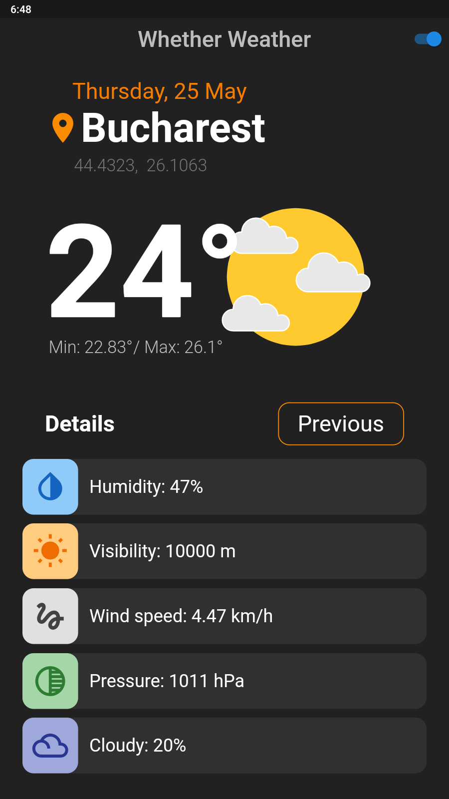

# Whether Weather

## A Flutter project for a minimal weather app

This is a simple implementation of a weather app using Flutter.

- Openweather API has been used to get the weather info.
- Additional information such as humidity, visibility and wind speed are also displayed.
- Future date weather also displayed.

---

### Usage

- Clone the repository.
- Sign up at [OpenWeather](https://openweathermap.org/api) for the API key.
- Go to `lib/util/util.dart` and update the API key.
- Run `flutter build` .

### Screenshots

Default location| Change location
--|--
|

Default information| Future information
--|--
|

Light Theme| Dark Theme
--|--
|

### TODO

1. Use Geolocator package to get the current location.
2. Better UI
